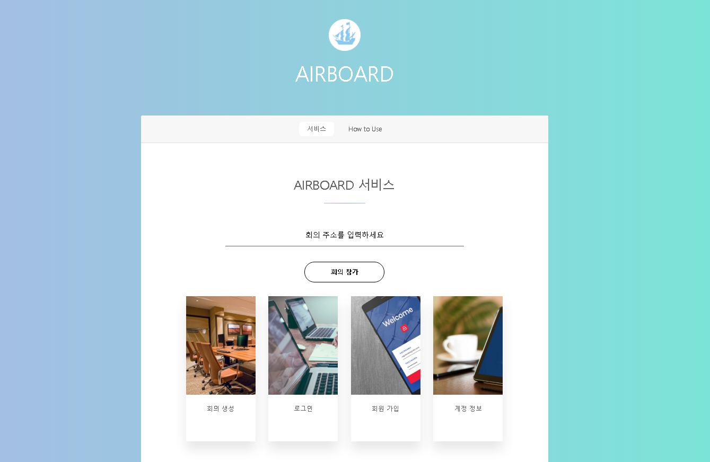
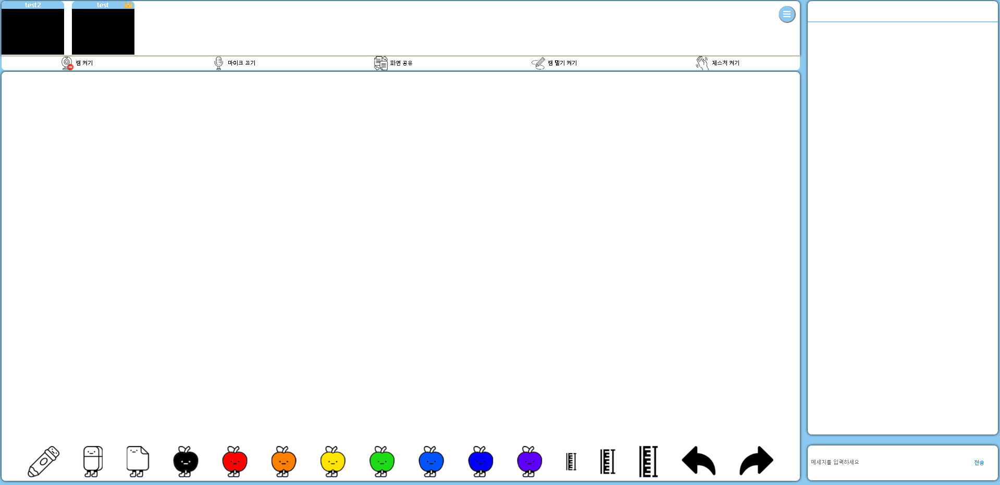

# AirBoard
[](https://stackshare.io/goingsamsung/airboard)
[](https://hits.seeyoufarm.com)

## 개요
AirBoard는 웹캠을 이용해 필기와 제스처 기능을 지원하는 화상 회의 플랫폼이다.

실시간 수업 중 부정확하고 느린 속도로 마우스로 필기하는 것을 보고 새로운 입력 방식에 대해 고민해 보게 되었다. 비대면 수업이 많아지면서 코로나19로 인해 전 국민 1인 1웹캠 시대다. 우리 팀은 모두가 갖고 있는 웹캠에 대해 단순 영상 입력 장치에서 한 단계 더 나아간 활용 방법을 제시하기 위해 AirBoard를 기획했다.

AirBoard는 실시간 카메라 공유, 화면 공유, 음성 채팅, 문자 채팅 등 Google Meet나 Zoom 등에 있는 기본적인 화상 희의 기능을 전부 제공한다. 여기에 더해 웹캠 앞에서 손이나 펜 등을 들고 그림을 그리면 그 궤적을 웹캠이 읽어 칠판에 글씨 쓰듯 그림을 그리거나 필기를 할 수 있다.

## 기대효과 및 활용방안
AirBoard는 웹캠을 새로운 입력 수단으로 사용할 수 있다는 가능성을 제시할 것이다. 웹캠을 이용해 사용자들은 화상 회의를 하면서 필기를 하거나 그림, 도형, 수식, 등을 자유롭게 그릴 수 있다. 그리고 언제든지 손 모양으로 제스처 기능을 실행할 수 있다.

## 결과물
### [AirBoard](https://airboard.ga/)

## Prerequisites
You have to install [Node.js](https://nodejs.org/en/), and [MongoDB](https://www.mongodb.com/) in your machine.

## Usage

- Clone the repository.

```bash
git clone https://github.com/GoingSamsung/AirBoard.git
cd webrtc-test
```

- Install with `npm`.

```bash
npm i
npm i --save-dev nodemon
```
- Change this part in `server.js` to test in local

Change this
```javascript
const express = require('express')
const app = express()
const fs = require('fs')
const https = require('https');
const server = https.createServer({
        key: fs.readFileSync('/etc/letsencrypt/live/airboard.ga/privkey.pem'),
        cert: fs.readFileSync('/etc/letsencrypt/live/airboard.ga/cert.pem'),
        ca: fs.readFileSync('/etc/letsencrypt/live/airboard.ga/chain.pem'),
        requestCert: false,
        rejectUnauthorized: false,
    },
    app
);

const io = require('socket.io')(server)
const { v4: uuidV4 } = require('uuid')
const mongoose = require('mongoose')
const User = require('./models/user')
const Room = require('./models/room')
const Account = require('./models/account')
const { response } = require('express')
const user = require('./models/user')
const { request } = require('http')
const bodyParser = require('body-parser')
const indexRoute = require("./routes/index")
const passport = require('passport')
const LocalStrategy = require('passport-local').Strategy
const Session = require('express-session')
const flash = require('connect-flash')
var MongoDBStore = require('connect-mongodb-session')(Session)
```
into

```javascript
const express = require('express')
const app = express()
const server = require('http').Server(app)
const io = require('socket.io')(server)
const { v4: uuidV4 } = require('uuid')
const fs = require('fs')

const mongoose = require('mongoose')
const User = require('./models/user')
const Room = require('./models/room')
const Account = require('./models/account')
const { response } = require('express')
const user = require('./models/user')
const { request } = require('http')
const bodyParser = require('body-parser')

const indexRoute = require("./routes/index")
const passport = require('passport')
const LocalStrategy = require('passport-local').Strategy
const Session = require('express-session')
const flash = require('connect-flash')
var MongoDBStore = require('connect-mongodb-session')(Session)
```

- Run.
```bash
npm run devStart
```
- Open at https://localhost:443 (https is mandatory due to WebRTC standard)


## Home


## Room


## License
[Apache License 2.0](https://github.com/GoingSamsung/AirBoard/blob/master/LICENSE)
