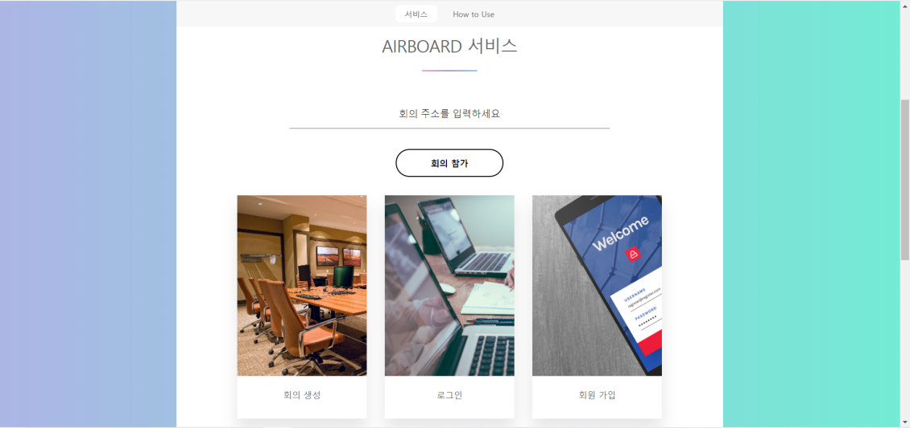
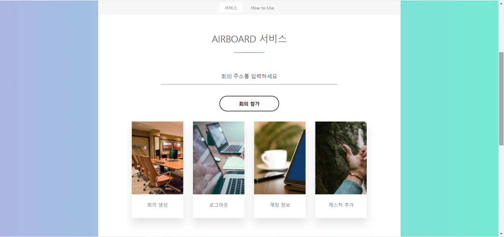
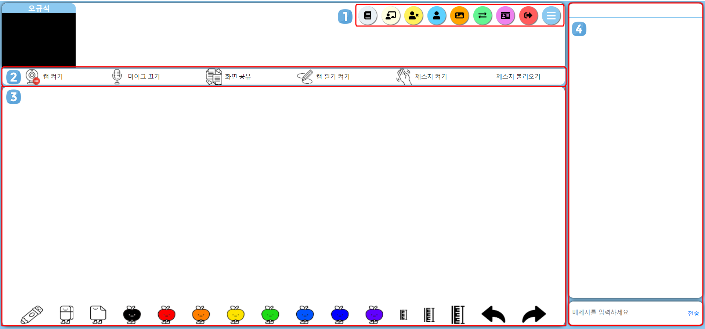

# AirBoard
[](https://stackshare.io/goingsamsung/airboard)
[](https://hits.seeyoufarm.com)

## 개요
AirBoard는 웹캠을 이용해 필기와 제스처 기능을 지원하는 화상 회의 플랫폼이다.

실시간 수업 중 부정확하고 느린 속도로 마우스로 필기하는 것을 보고 새로운 입력 방식에 대해 고민해 보게 되었다. 비대면 수업이 많아지면서 코로나19로 인해 전 국민 1인 1웹캠 시대다. 우리 팀은 모두가 갖고 있는 웹캠에 대해 단순 영상 입력 장치에서 한 단계 더 나아간 활용 방법을 제시하기 위해 AirBoard를 기획했다.

AirBoard는 실시간 카메라 공유, 화면 공유, 음성 채팅, 문자 채팅 등 Google Meet나 Zoom 등에 있는 기본적인 화상 희의 기능을 전부 제공한다. 여기에 더해 웹캠 앞에서 손이나 펜 등을 들고 그림을 그리면 그 궤적을 웹캠이 읽어 칠판에 글씨 쓰듯 그림을 그리거나 필기를 할 수 있다.

## 기대효과 및 활용방안
AirBoard는 웹캠을 새로운 입력 수단으로 사용할 수 있다는 가능성을 제시할 것이다. 웹캠을 이용해 사용자들은 화상 회의를 하면서 필기를 하거나 그림, 도형, 수식, 등을 자유롭게 그릴 수 있다. 그리고 언제든지 손 모양으로 제스처 기능을 실행할 수 있다.

## 결과물
### [AirBoard](https://airboard.ga/)

## Prerequisites
You have to install [Node.js](https://nodejs.org/en/), and [MongoDB](https://www.mongodb.com/) in your machine.

## Usage

- Clone the repository.

```bash
git clone https://github.com/GoingSamsung/AirBoard.git
cd webrtc-test
```

- Install with `npm`.

```bash
npm i
npm i --save-dev nodemon
```
- Change this part in `server.js` to test in local

Change this
```javascript
const express = require('express')
const app = express()
const fs = require('fs')
const https = require('https');
const server = https.createServer({
        key: fs.readFileSync('/etc/letsencrypt/live/airboard.ga/privkey.pem'),
        cert: fs.readFileSync('/etc/letsencrypt/live/airboard.ga/cert.pem'),
        ca: fs.readFileSync('/etc/letsencrypt/live/airboard.ga/chain.pem'),
        requestCert: false,
        rejectUnauthorized: false,
    },
    app
);

const io = require('socket.io')(server)
const { v4: uuidV4 } = require('uuid')
const mongoose = require('mongoose')
const User = require('./models/user')
const Room = require('./models/room')
const Account = require('./models/account')
const { response } = require('express')
const user = require('./models/user')
const { request } = require('http')
const bodyParser = require('body-parser')
const indexRoute = require("./routes/index")
const passport = require('passport')
const LocalStrategy = require('passport-local').Strategy
const Session = require('express-session')
const flash = require('connect-flash')
var MongoDBStore = require('connect-mongodb-session')(Session)
```
into

```javascript
const express = require('express')
const app = express()
const server = require('http').Server(app)
const io = require('socket.io')(server)
const { v4: uuidV4 } = require('uuid')
const fs = require('fs')

const mongoose = require('mongoose')
const User = require('./models/user')
const Room = require('./models/room')
const Account = require('./models/account')
const { response } = require('express')
const user = require('./models/user')
const { request } = require('http')
const bodyParser = require('body-parser')

const indexRoute = require("./routes/index")
const passport = require('passport')
const LocalStrategy = require('passport-local').Strategy
const Session = require('express-session')
const flash = require('connect-flash')
var MongoDBStore = require('connect-mongodb-session')(Session)
```

- Run.
```bash
npm run devStart
```
- Open at https://localhost:443 (https is mandatory due to WebRTC standard)


## Home - Before LogIn


로그인 전에는 3가지 메뉴가 있고, 각 메뉴의 기능은 다음과 같다.

1. 회의 생성 : 회의를 생성한다. 만약 로그인을 하지 않았다면 회의를 만들 수 없다.
3. 로그인 : 로그인 기능을 제공한다.
4. 회원가입 : 회원가입 기능을 제공한다. 회원가입은 이메일을 이용해 실시한다.

## Home - After LogIn


로그인 후에는 4가지 메뉴가 있고, 각 메뉴의 기능은 다음과 같다.

1. 회의 생성: 회의를 생성한다. 로그인을 한 후에는 회의를 생성할 수 있다.
2. 로그아웃 : 로그아웃 기능을 제공한다.
3. 계정 정보 : 로그인 한 계정의 정보를 확인할 수 있다. 자신의 이름을 바꿀 수 있다.
4. 제스처 추가 : 자신이 설정하는 커스텀 제스처를 만들 수 있다.

## Room


회의를 생성한 후 화상회의 방의 모습이다. 화상회의 방은 크게 4부분으로 나눌 수 있다.

1. 사용자 기능 버튼 : 사용자가 이용할 수 있는 기능들이 있는 버튼이다. 호스트 유저는 다른 유저들의 권한을 컨트롤 하기 위한 버튼을 추가적으로 가지고 있다. 각 기능들의 설명은 다음과 같다.   
   * 호스트 전용 버튼
      * 유저 리스트 보기 : 해당 버튼을 눌러 다른 사용자들의 캠, 오디오를 켜고 끌 수 있다. 다른 사용자를 강퇴시킬 수 있다.
      * 각자 캔버스 사용 : 회의 방에 참가한 사람들이 공유된 캔버스를 이용하는 것이 아닌, 각자의 캔버스에 필기할 수 있다.
      * 호스트만 캔버스 사용 : 회의 방의 캔버스를 호스트만 쓸 수 있도록 설정한다.
      * 모든 사용자 캔버스 사용 : 회의 방의 사람들이 공유되는 캔버스에 자유롭게 필기할 수 있다.
   * 공통 버튼
      * 스크린샷 : 캔버스에 그려진 내용들을 사진 파일로 저장한다.
      * 캠 필기 좌우 반전 : 자신이 사용하는 캠 필기 기능을 좌우 반전시킨다.
      * 자신의 보이는 이름 변경 : 해당 회의에서 보이는 자신의 이름을 변경한다.
      * 방에서 퇴장 : 방에서 퇴장한다.
3. 사용자 회의 기능 버튼 : 사용자가 이용할 수 있는 회의 기능들이 있는 버튼이다. 각 기능들의 설명은 다음과 같다.   
   * 캠 켜기/끄기 : 자신의 캠을 키거나 끌 수 있다. 
   * 마이크 켜기/끄기 : 자신의 마이크를 키거나 끌 수 있다.
   * 화면 공유 켜기/끄기 : 자신이 보여주고 싶은 화면을 공유하고, 공유를 취소할 수 있다.
   * 캠 필기 켜기/끄기 : 자신의 캠을 이용해서 인식한 필기구를 이용해, 허공에 그리는 것으로 캔버스에 그릴 수 있는 캠 필기 기능을 키거나 끌 수 있다.
   * 제스처 켜기/끄기 : 자신의 캠을 이용해서 인식한 손 제스처로 다양한 회의 기능들을 이용할 수 있게 하는 기능을 키거나 끌 수 있다. 해당 기능들은 다음과 같다.
      * V 모양 : 캔버스 스크린샷 기능
      * 따봉 모양 : 다른 사용자들도 볼 수 있는 따봉 반응 보이기
      * 모든 손가락을 위로 모은 모양 : 캔버스 모두 지우기
   * 제스처 불러오기 : 자신이 설정한 나만의 제스처를 불러와 기능을 사용할 수 있게 한다. 나만의 제스처로 사용할 수 있는 기능은 마이크 켜기/끄기 기능이다.
5. 캔버스 영역 : 사용자가 다른 사용자들과 함께 이용할 수 있는 캔버스이다. 아래쪽에는 캔버스에서 이용할 수 있는 다양한 기능 버튼들이 있다.
6. 채팅 영역 : 다른 사용자들과 채팅을 나눌 수 있는 영역이다.

## 제스처 추가
계정에 로그인한 후 사용자가 제스처를 지정하고 회의실에서 사용할 수 있다.

1. 각 손가락의 모양과 굽은 정도를 설정한다.

| No curl | Half curl | Full curl |
|--|--|--|
|  |  |  |

2. 각 손가락의 방향과 방향의 정도를 설정하고 저장한다.

| 방향 | 지정값 |
|--|--|
| ↑ | 00:00 |
| ↗ | 01:30 |
| → | 03:00 |
| ↘ | 04:30 |
| ↓ | 06:00 |
| ↙ | 07:30 |
| ← | 09:00 |
| ↖ | 10:30 |

3. 회의실 안에서 제스처 불러오기 버튼을 클릭한다.
4. 회의실에서 제스처 켜기 버튼을 클릭한 후 사용한다.


## License
[Apache License 2.0](https://github.com/GoingSamsung/AirBoard/blob/master/LICENSE)
